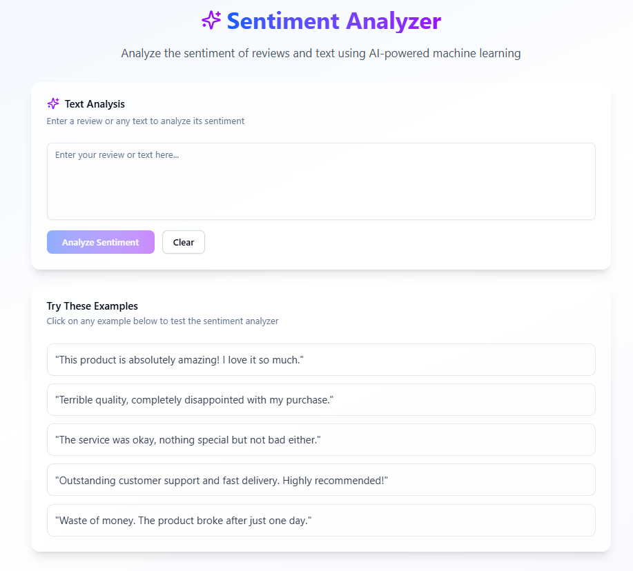
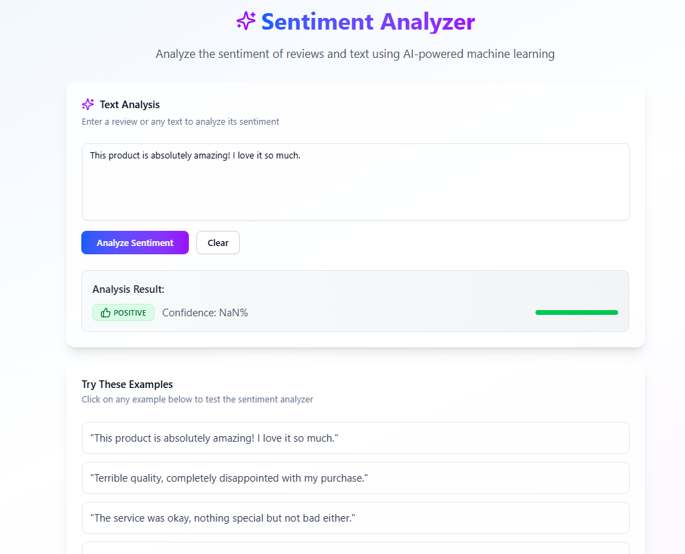
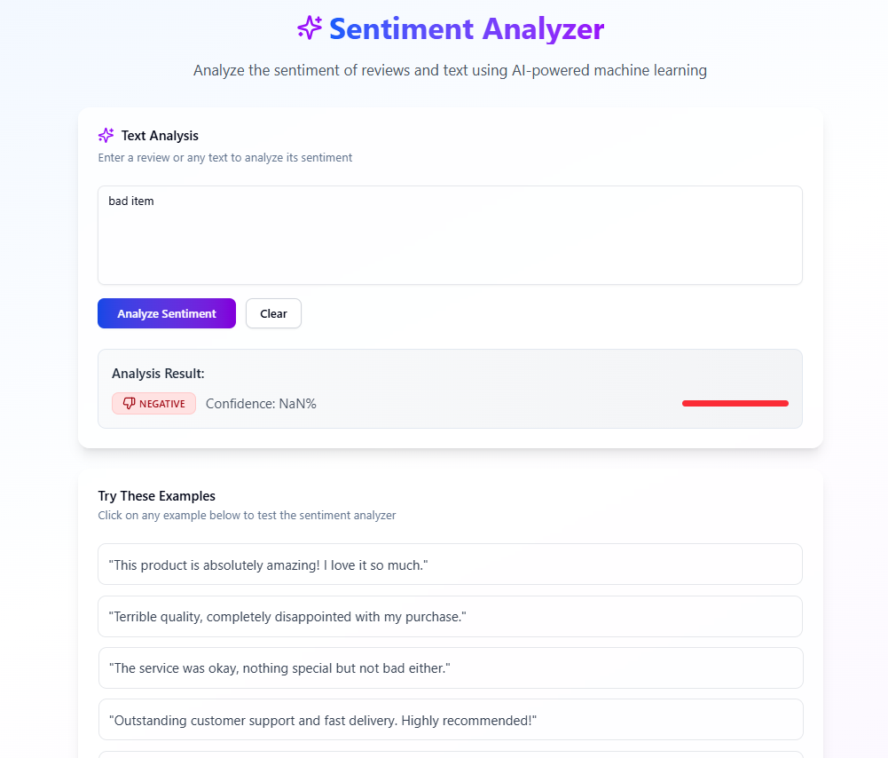

### **Sentiment Analysis Using Machine Learning**

This project focuses on performing sentiment analysis on textual data using classical machine learning techniques and basic Natural Language Processing (NLP). The goal is to determine whether a given text expresses a **positive**, **negative** sentiment. The model is trained on labeled text data and uses standard NLP preprocessing methods to convert raw text into machine-readable features.

---

### **Key Features:**

- 📊 **Supervised Machine Learning Model:**

  - Built using algorithms such as **Logistic Regression**, **Naive Bayes**, or **Support Vector Machines (SVM)** for classification tasks.
  - Trained on a labeled dataset of text samples annotated with sentiment labels (positive, negative).

- 🧠 **Basic NLP Preprocessing:**

  - Text cleaning (removing punctuation, special characters, and stopwords)
  - Tokenization and lowercasing
  - Lemmatization or stemming
  - Feature extraction using **Bag of Words (BoW)** or **TF-IDF vectorization**

- 📁 **Dataset:**

  - A text dataset (tweets) labeled for sentiment.
  - Split into training and testing sets for model evaluation.

- 📈 **Model Evaluation:**

  - Accuracy, Precision, Recall, and F1-score used to evaluate performance.
  - Confusion matrix to visualize classification results.

---

### **Workflow Overview:**

1. **Data Collection:** Import and clean the sentiment-labeled dataset.
2. **Preprocessing:** Use basic NLP techniques to prepare text data.
3. **Feature Engineering:** Convert text into numerical features using TF-IDF or BoW.
4. **Model Training:** Fit the model using a suitable ML algorithm.
5. **Prediction & Evaluation:** Predict sentiment on test data and evaluate performance.
6. **Deployment (optional):** Integrate the model into a web app using Flask for user interaction.

---

### **Technologies Used:**

- Python
- Scikit-learn
- NLTK
- Pandas, NumPy
- Matplotlib
- Flask

---

### **Images:**

